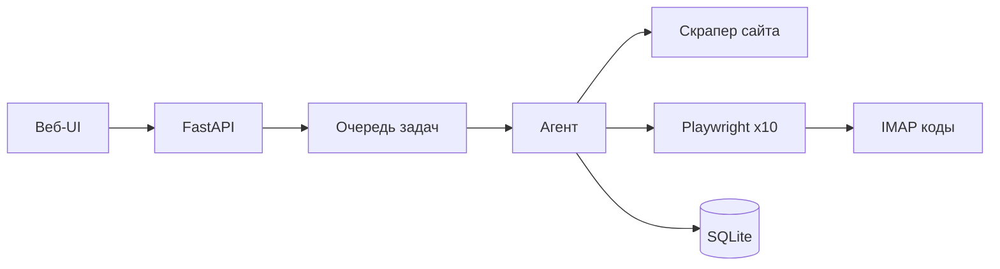

# Catalog Agent

Автоматический агент для **регистрации сайта компании в каталогах и справочниках** с целью получения **обратных ссылок** (backlinks) на продвигаемый домен.

Вы добавляете в веб-интерфейсе URL сайта и email — агент сам:

1. Собирает данные компании с сайта (название, описание, телефон, услуги, логотип).
2. По очереди проходит **10 каталогов**: регистрация, подтверждение по почте, заполнение карточки.
3. Сохраняет в SQLite логины, пароли, ссылки на профиль и итоговые backlink-URL.

Стек: **FastAPI** + **Playwright** + **SQLite** + **IMAP** + парсинг через **httpx/BeautifulSoup**.

---

## Содержание

- [Зачем это нужно](#зачем-это-нужно)
- [Как это работает](#как-это-работает)
- [Установка](#установка)
- [Веб-интерфейс](#веб-интерфейс)
- [Режимы: DEMO и LIVE](#режимы-demo-и-live)
- [10 каталогов](#10-каталогов-тестовая-версия)
- [Настройка (.env)](#настройка-env)
- [Почта IMAP](#почта-imap-коды-подтверждения)
- [База данных](#база-данных)
- [HTTP API](#http-api)
- [Структура проекта](#структура-проекта)
- [Расширение: новый каталог](#расширение-новый-каталог)
- [Отладка Playwright](#отладка-playwright)
- [Ограничения и риски](#ограничения-и-риски)
- [FAQ](#faq)

---

## Зачем это нужно

| Задача | Как решает агент |
|--------|------------------|
| Много однотипных регистраций | Один запуск → 10 каталогов подряд |
| Данные с сайта клиента | Скрапер подставляет текст, URL, телефон в формы |
| Коды из почты | IMAP опрашивает ящик и вводит код подтверждения |
| Учёт доступов | Таблица: email/пароль, URL профиля, backlink по каждому каталогу |

Обратная ссылка — это URL на ваш сайт в карточке компании в каталоге (поле «сайт», «URL», ссылка в описании и т.п., зависит от площадки).

---

## Как это работает



**Пошагово для одного сайта:**

1. **POST /api/sites** — в БД создаётся запись, задача уходит в фоновую очередь.
2. **Скрапинг** — `app/scraper.py` загружает главную (или редирект), вытаскивает title, meta description, og:image, телефон, пункты меню как «услуги». Если сеть недоступна — подставляются заглушки, регистрация всё равно идёт.
3. **Цикл по 10 каталогам** — для каждого создаётся строка в `registrations`, запускается Chromium:
   - открывается страница регистрации;
   - заполняются email, сгенерированный пароль, название, описание, URL сайта, телефон;
   - отправка формы;
   - при необходимости — ожидание письма и ввод кода (IMAP или `#demo-code` в DEMO);
   - доп. поля профиля (описание, услуги).
4. **Результат** — статус `done` / `failed`, логин, пароль, ссылки пишутся в БД. Статус сайта → `completed`.

Статусы сайта: `pending` → `scraping` → `ready` → `completed` (или `scrape_error` при критической ошибке до цикла каталогов).

Статусы регистрации: `pending` → `running` → `done` | `failed`.

---

## Установка

### Требования

- Python **3.11+** (проверено на 3.12)
- Linux / macOS / WSL (для Playwright на Windows — отдельная установка браузеров)

### Команды

```bash
cd catalog-agent

python3 -m venv .venv
source .venv/bin/activate          # Windows: .venv\Scripts\activate

pip install -r requirements.txt
playwright install chromium        # один раз, ~100 MB

cp .env.example .env
# при необходимости отредактируйте .env

uvicorn app.main:app --reload --host 127.0.0.1 --port 8000
```

Откройте в браузере: **http://127.0.0.1:8000**

### Проверка без UI (консоль)

```bash
source .venv/bin/activate
python -c "
import asyncio
from app import db
from app.agent import process_site

async def main():
    await db.init_db()
    sid = await db.create_site('https://example.com', 'you@mail.ru')
    await process_site(sid)
    regs = await db.get_registrations_for_site(sid)
    print('OK:', sum(1 for r in regs if r['status']=='done'), '/ 10')

asyncio.run(main())
"
```

В `DEMO_MODE=true` ожидается **10/10** без интернета к каталогам.

---

## Веб-интерфейс

Минималистичный UI на серых кнопках (`static/style.css`).

| Блок | Назначение |
|------|------------|
| **Добавить сайт** | Поля URL и email → кнопка «Запустить регистрацию» |
| **Каталоги (10)** | Список подключённых площадок и badge DEMO/LIVE |
| **Сайты и статусы** | Прогресс по каждому каталогу, кнопка **Повтор** |
| **Все регистрации** | Сводная таблица: логин, пароль, профиль, backlink, ошибка |

Таблицы обновляются автоматически каждые 8 секунд и по кнопке «Обновить».

**Повтор** — `POST /api/sites/{id}/retry`: сбрасывает статус сайта и снова ставит задачу в очередь (повторный скрапинг + все 10 каталогов).

---

## Режимы: DEMO и LIVE

### DEMO (по умолчанию)

```env
DEMO_MODE=true
```

- Playwright открывает локальные HTML: `static/demo/register.html` → `verify.html` → `profile.html` (протокол `file://`).
- Код подтверждения показывается на странице в элементе `#demo-code` — агент читает его без почты.
- Не нужны ни реальные каталоги, ни IMAP, ни стабильный интернет к внешним сайтам.
- Имена каталогов в UI те же (Yell, OrgPage, …), но URL регистрации подменяется на демо-форму с параметром `?catalog=yell` и т.д.
- Backlink в демо имеет вид: `https://catalog.local/{id}/company?url=...`

**Назначение:** отладка пайплайна, демо заказчику, CI, обучение оператора.

### LIVE

```env
DEMO_MODE=false
```

- Playwright идёт на **реальные URL** из `app/catalogs/registry.py`.
- Используется универсальный адаптер `LiveCatalogAdapter`: ищет поля `email`, `password`, `company`, `textarea`, `tel` и кнопки «Регистрация» / «Добавить».
- После отправки формы, если на странице есть слова «код», «подтвержд», агент ждёт письмо по **IMAP** (см. ниже) и повторяет шаг с кодом.

**Важно:** у реальных каталогов часто есть капча, SMS, ручная модерация и уникальная вёрстка. Универсальные селекторы покрывают не все площадки — для продакшена нужны **отдельные адаптеры** под каждый сайт (см. [Расширение](#расширение-новый-каталог)).

---

## 10 каталогов (тестовая версия)

| № | ID | Название | URL регистрации (LIVE) |
|---|-----|----------|-------------------------|
| 1 | `yell` | Yell.ru | https://www.yell.ru/history/add/ |
| 2 | `orgpage` | OrgPage.ru | https://www.orgpage.ru/add/ |
| 3 | `spravker` | Spravker.ru | https://spravker.ru/add-company |
| 4 | `allbiz` | AllBiz.ru | https://www.allbiz.ru/add/ |
| 5 | `list_org` | List-Org.com | https://www.list-org.com/?mode=add |
| 6 | `bizorg` | BizOrg.su | https://www.bizorg.su/add_firm |
| 7 | `ruscatalog` | RusCatalog.org | https://www.ruscatalog.org/add/ |
| 8 | `tiuru` | Tiuru.ru | https://tiuru.ru/add-company.html |
| 9 | `firmika` | Firmika.ru | https://firmika.ru/company/add |
| 10 | `catalog10` | Справочник №10 | (заглушка, URL задаётся в registry) |

Подсказки для поиска письма с кодом: `email_sender_hint` в метаданных (фильтр по отправителю в IMAP).

Список каталогов в коде: `app/catalogs/registry.py` → `CATALOG_META_LIST`.

---

## Настройка (.env)

Скопируйте `.env.example` в `.env`. Все переменные (регистр не важен):

| Переменная | По умолчанию | Описание |
|------------|--------------|----------|
| `DEMO_MODE` | `true` | Локальные демо-формы vs реальные каталоги |
| `APP_BASE_URL` | `http://127.0.0.1:8000` | Базовый URL приложения (для маршрутов `/demo/...` в UI) |
| `DATABASE_PATH` | `data/catalog_agent.db` | Путь к SQLite |
| `IMAP_HOST` | `imap.mail.ru` | Сервер IMAP |
| `IMAP_PORT` | `993` | Порт SSL |
| `IMAP_USER` | — | Логин почты |
| `IMAP_PASSWORD` | — | Пароль приложения |
| `IMAP_FOLDER` | `INBOX` | Папка входящих |
| `PLAYWRIGHT_HEADLESS` | `true` | `false` — видимый браузер |
| `PLAYWRIGHT_TIMEOUT_MS` | `60000` | Таймаут действий Playwright, мс |
| `SECRET_KEY` | `dev-secret` | Зарезервировано под будущие сессии |

Пример минимального `.env` для LIVE + Mail.ru:

```env
DEMO_MODE=false
IMAP_HOST=imap.mail.ru
IMAP_USER=company@mail.ru
IMAP_PASSWORD=xxxxxxxxxxxxxxxx
PLAYWRIGHT_HEADLESS=false
```

---

## Почта (IMAP, коды подтверждения)

Модуль: `app/email_imap.py`.

**Логика:**

1. После отправки формы регистрации агент до 12 раз с интервалом 10 с опрашивает последние письма во входящих.
2. В теме/теле ищет код по шаблонам: 4–8 цифр, «код: 123456», «code: …».
3. Найденный код сохраняется в таблицу `email_codes` и подставляется в форму подтверждения.

**Фильтры** (из метаданных каталога): подстрока в поле From и в Subject.

### Провайдеры

| Почта | IMAP_HOST | Примечание |
|-------|-----------|------------|
| Mail.ru | `imap.mail.ru` | Пароль для внешних приложений в настройках |
| Yandex | `imap.yandex.ru` | Пароль приложения |
| Gmail | `imap.gmail.com` | App Password + «менее безопасные приложения» / OAuth |
| Rambler | `imap.rambler.ru` | Аналогично |

Используйте **отдельный ящик** под регистрации, не личную почту.

В DEMO режиме IMAP не обязателен.

---

## База данных

Файл: `data/catalog_agent.db` (создаётся при старте).

### Таблица `sites`

| Поле | Описание |
|------|----------|
| `url` | URL продвигаемого сайта |
| `email` | Email для регистраций во всех каталогах |
| `status` | Общий статус обработки |
| `company_json` | JSON с данными скрапера |

### Таблица `registrations`

| Поле | Описание |
|------|----------|
| `catalog_id` / `catalog_name` | Площадка |
| `status` | `pending`, `running`, `done`, `failed` |
| `login` | Обычно тот же email |
| `password` | Сгенерированный пароль (хранится в открытом виде — см. [риски](#ограничения-и-риски)) |
| `profile_url` | URL карточки после регистрации |
| `backlink_url` | Ссылка на ваш сайт в каталоге |
| `error_message` | Текст ошибки |
| `log_json` | Пошаговый лог действий Playwright |

### Таблица `email_codes`

История найденных кодов (аудит).

Просмотр вручную:

```bash
sqlite3 data/catalog_agent.db "SELECT catalog_name, login, password, backlink_url, status FROM registrations;"
```

---

## HTTP API

| Метод | Путь | Описание |
|-------|------|----------|
| `GET` | `/` | Веб-интерфейс |
| `GET` | `/api/catalogs` | Список 10 каталогов + флаг `demo_mode` |
| `GET` | `/api/sites` | Сайты с вложенными регистрациями |
| `GET` | `/api/registrations` | Все регистрации (плоская таблица) |
| `POST` | `/api/sites` | Тело: `{"url":"https://...","email":"a@b.ru"}` — запуск агента |
| `POST` | `/api/sites/{id}/retry` | Повторить обработку сайта |

Демо-страницы (если открывать вручную): `/demo/{catalog_id}/register`, `/verify`, `/profile`.

---

## Структура проекта

```
catalog-agent/
├── app/
│   ├── main.py              # FastAPI, API, lifespan, demo routes
│   ├── config.py            # Settings из .env
│   ├── db.py                # SQLite, CRUD
│   ├── agent.py             # Оркестратор: скрапинг → 10 × Playwright
│   ├── worker.py            # Фоновая очередь asyncio
│   ├── scraper.py           # Парсинг сайта клиента
│   ├── email_imap.py        # IMAP + ожидание кода
│   └── catalogs/
│       ├── registry.py      # Список 10 каталогов, build_adapter()
│       ├── base.py          # CatalogAdapter, генерация пароля
│       └── adapters.py      # DemoCatalogAdapter, LiveCatalogAdapter
├── static/
│   ├── style.css            # Стили UI
│   ├── app.js               # Логика фронта
│   └── demo/                # register.html, verify.html, profile.html
├── templates/
│   └── index.html           # Главная страница
├── data/                    # SQLite (в .gitignore)
├── requirements.txt
├── .env.example
└── README.md
```

---

## Расширение: новый каталог

1. Добавьте запись в `CATALOG_META_LIST` в `app/catalogs/registry.py`:

```python
CatalogMeta(
    id="my_catalog",
    name="MyCatalog.ru",
    register_url="https://mycatalog.ru/add",
    email_sender_hint="mycatalog",
    email_subject_hint="подтверждение",  # опционально
),
```

2. Для LIVE с нестандартной формой создайте класс в `adapters.py`, наследуя `CatalogAdapter`, и переопределите `register()` / `fill_profile()`.

3. В `build_adapter()` подключите свой класс вместо `LiveCatalogAdapter` для этого `id`.

4. Протестируйте с `PLAYWRIGHT_HEADLESS=false` и смотрите `log_json` в БД.

Демо-формы используют фиксированные id: `#email`, `#password`, `#company`, `#website`, `#btn-register`, `#code`, `#description`, `#phone`, `#services`, `#backlink-preview`.

---

## Отладка Playwright

```env
PLAYWRIGHT_HEADLESS=false
PLAYWRIGHT_TIMEOUT_MS=120000
```

- Запускайте один сайт и смотрите браузер.
- Лог шагов: поле `log_json` в `registrations`.
- При падении на `wait_for_url` проверьте, что в DEMO открываются `file://` пути к `static/demo/`.

Повтор одного сайта: кнопка **Повтор** в UI или `POST /api/sites/{id}/retry`.

---

## Ограничения и риски

- **Пароли в SQLite без шифрования** — для продакшена нужны шифрование БД, vault или хотя бы ограничение доступа к файлу.
- **Капча и антибот** — универсальный LIVE-адаптер не обходит reCAPTCHA; возможны только ручной ввод или сервисы распознавания (не входят в проект).
- **Правила каталогов** — массовая автоматическая регистрация может нарушать ToS площадок; используйте на свой риск и в рамках закона/правил сайтов.
- **Актуальность URL** — ссылки на формы добавления компаний могут устареть; проверяйте вручную.
- **Один email на все каталоги** — так задумано в v1; при необходимости можно расширить модель.
- **Очередь в памяти** — при перезапуске сервера незавершённые задачи из очереди теряются (записи в БД остаются).

---

## FAQ

**Почему все 10 в failed в LIVE?**  
Чаще всего: капча, изменилась вёрстка, неверный IMAP или письмо не пришло. Включите DEMO для проверки логики, затем донастраивайте адаптер под один каталог.

**Скрапинг не берёт данные с сайта**  
Проверьте доступность URL с сервера, SSL, редиректы. При ошибке сети подставляются заглушки — регистрация продолжается.

**Как сменить число каталогов?**  
Добавьте/удалите элементы в `CATALOG_META_LIST` — цикл в `agent.py` идёт по `get_all_catalogs()`.

**Можно ли запускать без uvicorn?**  
Да, через `process_site(site_id)` как в примере выше.

**Где логотип?**  
Скрапер пишет `logo_url` / `og_image` в `company_json`; загрузка файла в форму каталога зависит от конкретного адаптера (в DEMO не используется).

---

## Лицензия и автор

Проект создан как рабочий прототип для SEO/линкбилдинга. Доработка под конкретные каталоги — по мере подключения LIVE-режима.
